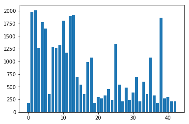
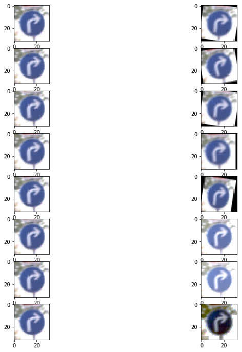
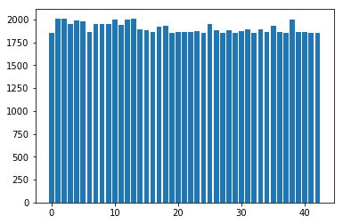
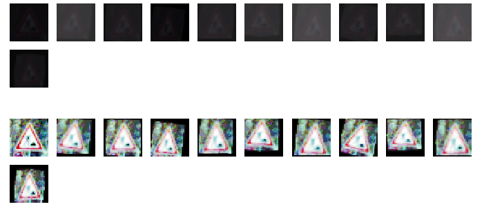
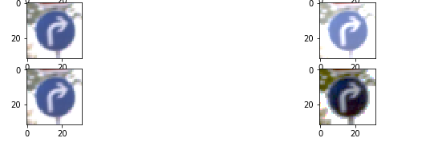

**Traffic Sign Recognition** 

Author: Jayprasad Hegde

---

**Build a Traffic Sign Recognition Project**

The goals / steps of this project are the following:
* Load the data set (see below for links to the project data set)
* Explore, summarize and visualize the data set
* Design, train and test a model architecture
* Use the model to make predictions on new images
* Analyze the softmax probabilities of the new images
* Summarize the results with a written report

[//]: # (Image References)

[image1]: ./examples/databeforeaug.png "Visualization"
[image2]: ./examples/grayscale.jpg "Grayscaling"
[image3]: ./examples/random_noise.jpg "Random Noise"
[image4]: ./examples/placeholder.png "Traffic Sign 1"
[image5]: ./examples/placeholder.png "Traffic Sign 2"
[image6]: ./examples/placeholder.png "Traffic Sign 3"
[image7]: ./examples/placeholder.png "Traffic Sign 4"
[image8]: ./examples/placeholder.png "Traffic Sign 5"

## Rubric Points
###Here I will consider the [rubric points](https://review.udacity.com/#!/rubrics/481/view) individually and describe how I addressed each point in my implementation.  

---
**Writeup / README

####1. Provide a Writeup / README that includes all the rubric points and how you addressed each one. You can submit your writeup as markdown or pdf. You can use this template as a guide for writing the report. The submission includes the project code.

You're reading it! and here is a link to my [project code](https://github.com/topgoonr/CarND-Traffic-Sign-Classifier-Project/blob/master/Traffic_Sign_Classifier.ipynb) or a much more [readable version of the entire code]  with the necessary visualizations.

**Data Set Summary & Exploration

####1. Provide a basic summary of the data set. In the code, the analysis should be done using python, numpy and/or pandas methods rather than hardcoding results manually.

I used the numpy  library to calculate summary statistics of the traffic
signs data set:

* The size of training set is 34799
* The size of the validation set is 4410
* The size of test set is 12630
* The shape of a traffic sign image is 32x32
* The number of unique classes/labels in the data set is 43

####2. Include an exploratory visualization of the dataset.

Here is an exploratory visualization of the data set. 
It is a bar chart showing how the data looks like:

Important points and actions taken
* The data is clearly lopsided. There are some classes that are way more skewed in favour of the others
* Action: I started to consider measures to create a common ground for all the classes. Most of them would have _roughly the same frequency.
* Jitter through rotation (-15, 15), shear (5) and translation (5)
* These jittered versions will be used to litter the training set with more data, and have nearly equal frequencies for all classes.
* (I have intentionally not done negative example additions here. )

I was able to go through LeCun's paper and understand that he was able to generate a robust training set by creating additional elements by jittering.

The techniques for jittering were: 
* Rotation (-15, 15)
* Translation (5)
* Shearing (5)
* Brightness 

All the images were manipulated in the RGB colour scheme.

All the three techniques were just enough for augmentation. I call these 'perturbations' throughout the code.

Here is a look at the images after a standard jitter: 

**Design and Test a Model Architecture

####1. Describe how you preprocessed the image data. What techniques were chosen and why did you choose these techniques? Consider including images showing the output of each preprocessing technique. Pre-processing refers to techniques such as converting to grayscale, normalization, etc. (OPTIONAL: As described in the "Stand Out Suggestions" part of the rubric, if you generated additional data for training, describe why you decided to generate additional data, how you generated the data, and provide example images of the additional data. Then describe the characteristics of the augmented training set like number of images in the set, number of images for each class, etc.)

As described in the previous section additional data was generated to augment the training set. 
This improved the overall frequencies of the various class of traffic signs. 

The data looks like this after the augmentation of the perturbations: 

However, this would still not be enough. There was the matter of cleaning up the image too.

I started looking at the images to see what could be a great fit for cleaning up the images
Some of the images were either too dark, or too bright. The colours were either washed out or too saturated.

I started looking around for contrast, but another interesting technique was at hand:
Equalization of the histogram. This allows the image to be well represented. 
Consequently, a great effect is that relevant parts of the image start standing out.

I have two techniques in the code for equalizing the histogram. 
I have one version where only the Y channel is equalized, after doing a RGB2YCR_CB format.

An assumption was that the image would always be 32x32, and most of the image would be related to the sign.
I test this in the unseen testing cases as well by throwing a lot of  images at the system.

Here are examples of a traffic sign image before AND _after preprocessing.

and one more example of an original with a  jittered image, and an original with a preprocessed image

As a last step, I normalized the image data using the mean/standard deviation approach as well. 
Showing the normalized image (just for effect):
![after normalization][./examples/afternomarlization.png]

The difference between the original data set and the augmented data set is the following ... 

Of course, this does not change the frequencies of the augmented data set: Only the individual images.
The augmented data set looks like this: 

** The Final Architecture of the Neural Net

####2. Describe what your final model architecture looks like including model type, layers, layer sizes, connectivity, etc.) Consider including a diagram and/or table describing the final model.

I started with LeNet and graduated to a much more deeper layer of NNs.
LeNet was giving me 88% validation accuracy off the bat, but more needed to be done.

I started building a second NN that would have a complex Covnet sequence -- one which 
would keep building the depth of the Covnet beyond 43. It goes upto 64.

The filters were largely of dim 5x5 for the most part in these Covnets.

So, I built a 3 sequence Covnet+MaxPooling layers followed by 2 fully connected layers with a Dropout.

The code 'secondneuralnetarch' describes this in great detail.

My final model consisted of the following layers:

| Layer         		|     Description	        					| 
|:---------------------:|:---------------------------------------------:| 
| Input         		| 32x32x3 RGB image   							| 
| Convolution 3x3     	| 1x1 stride, valid padding, outputs 28x28x16 	|
| RELU					|												|
| Max pooling	      	| 2x2 stride,  outputs 14x14x16 				|
| Convolution 3x3     	| 1x1 stride, valid padding, outputs 10x10x32 	|
| RELU					|												|
| Max pooling	      	| 2x2 stride,  outputs 5x5x32   				|
| Convolution 3x3     	| 1x1 stride, valid padding, outputs 4x4x64 	|
| RELU					|												|
| Max pooling	      	| 2x2 stride,  outputs 2x2x64   				|
| Flattening     	    | 2x2x64 --> 1x256  							|
| Fully connected		| 1x256 * 256x120 -> 1x120        				|
| Dropout       		|           									|
| Fully connected		| 1x120 * 120x84 --> 1x84						|
| Dropout       		|           									|
| Fully connected		| 1x84 * 84*43 --> 1x43, no activation  		|
| Softmax				| Softmax with Cross Entropy 					|
| Optimizer				| Adam optimizer   							    |
|						|												|
 

####3. Describe how you trained your model. The discussion can include the type of optimizer, the batch size, number of epochs and any hyperparameters such as learning rate.

** Training 
To train the model, I made batches of 128 each. 
The optimizer is an AdamOptimizer. 

I started using 10 Epochs. However, this was not converging at 10. A value of 20 did it fine. 
Having a GPU for training, does most definitely help, as the durations of the training can be quite long otherwise.

####4. Describe the approach taken for finding a solution and getting the validation set accuracy to be at least 0.93. Include in the discussion the results on the training, validation and test sets and where in the code these were calculated. Your approach may have been an iterative process, in which case, outline the steps you took to get to the final solution and why you chose those steps. Perhaps your solution involved an already well known implementation or architecture. In this case, discuss why you think the architecture is suitable for the current problem.

** Approach for finding a solution

Starting with  a base NN architecture as LeNet was clearly inadequate. 
Preprocessing the images started helping the overall cause, as the results started to look better on validation.
However I still had a peak of 91% validation at this point of time. 

Looking at the Covnets and making them deeper definitely helped, as the overall accuracy started touching 93%. 

Adding dropouts added a further more percentage points to the overall NN. 

Although, I tried increasing the size of the fully connected layers. 
This was not achieving the desired results for me. 

I started deepening the network further by adding another Covnet with a max pool layer and a RELU. This improved the overall fitting of the network. I started tweaking the output to deepen this further. Tuning the output parameters was also important from the base version of the LeNet to the final version. This helped improve the overall precision numbers during validation and testing. 

Augmenting the dataset helped this further. However, I had to be very careful in how I was augmenting this. 
Using the histogram equalization technique helped further. I started doing a simple multiplication by 5 as an augmentation. However, this was clearly a naive solution to augmentation as it only worsens the effect of the frequencies. The large numbers get larger, and the small numbers look smaller. So, equalizing the frequencies helped with creating a better/fairer training set. I did not add negative images, as that was not really a concern when I started training. Underfitting was an issue.
Adding dropouts started making the learning better. These were added to ensure that overfitting is not really an issue.

I have included both the initial and the final iterations of the network that I have created. The intermediate iterations have not been intentionally included for brevity. 

My final model results were:
* validation set accuracy of 96%  
* test set accuracy of 92%

* Test a Model on New Images

####1. Choose five German traffic signs found on the web and provide them in the report. For each image, discuss what quality or qualities might be difficult to classify.

Here are five German traffic signs that I found on the web:

[70][!70.jpeg]
[curve][!curve.jpeg]
[cycle][!cycle.jpeg
[deer][!deer.jpeg]
[leftstraight][!leftstraight.jpeg]
[menatwork][!menatwork.jpeg]
[mix.jpeg][!mix.jpeg]
[railway][!railway.jpeg]
[right][!right.jpeg]
[school][!school.jpeg]
[th][!th.jpeg]
[updown][!updown.jpeg]
[yield][!yield.jpeg]

These are fairly realistic images, and I have chosen them because some of them have an inbuilt noise or might be at the zoom levels that are not explicitly mentioned here. The second interesting element is that a 32x32 image introduces its own set of errors that the larger image might not have, and results in the model finding it difficult to classify the images then.

The first image might be difficult to classify because ...

####2. Discuss the model's predictions on these new traffic signs and compare the results to predicting on the test set. At a minimum, discuss what the predictions were, the accuracy on these new predictions, and compare the accuracy to the accuracy on the test set (OPTIONAL: Discuss the results in more detail as described in the "Stand Out Suggestions" part of the rubric).

Here are the results of the prediction:

| Image			        |     Prediction	        					| 
|:---------------------:|:---------------------------------------------:| 
| Stop Sign      		| Stop sign   									| 
| U-turn     			| U-turn 										|
| Yield					| Yield											|
| 100 km/h	      		| Bumpy Road					 				|
| Slippery Road			| Slippery Road      							|

The model was able to correctly guess 4 of the 5 traffic signs, which gives an accuracy of 80%. This compares favorably to the accuracy on the test set of ...

####3. Describe how certain the model is when predicting on each of the five new images by looking at the softmax probabilities for each prediction. Provide the top 5 softmax probabilities for each image along with the sign type of each probability. (OPTIONAL: as described in the "Stand Out Suggestions" part of the rubric, visualizations can also be provided such as bar charts)

The code for making predictions on my final model is located in the 11th cell of the Ipython notebook.

For the first image, the model is relatively sure that this is a stop sign (probability of 0.6), and the image does contain a stop sign. The top five soft max probabilities were

| Probability         	|     Prediction	        					| 
|:---------------------:|:---------------------------------------------:| 
| .60         			| Stop sign   									| 
| .20     				| U-turn 										|
| .05					| Yield											|
| .04	      			| Bumpy Road					 				|
| .01				    | Slippery Road      							|

For the second image ... 

### (Optional) Visualizing the Neural Network (See Step 4 of the Ipython notebook for more details)
####1. Discuss the visual output of your trained network's feature maps. What characteristics did the neural network use to make classifications?

